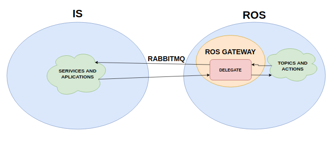

# is-ros-pkg
ROS package that contains Codes for integration between Intelligent Spaces (from [UFES](https://github.com/labviros) or IFES Guarapari) with the Robot Operating System (ROS), so that the resources of both platforms can be used together.

## Status

The codes made so far serve only to read the actual position of a robot and send to it a different position/destiny.

The simple application elaborated serves as an example for discussing the subject in project meetings.

## How it works

The ROS package contains the is-wire-py and is-msgs libraries, that communicate the ROS internal environment with the IS from the IS message exchange structure itself. In this way, the robot remains independent of the IS, as it can continue operating in its absence, and once connected to the IS, the robot can receive stimulus from outside of it, working similarly as a service (with only one container) of the Intelligent Space.

### Schematic



## Usage

Clone this repository to your catkin workspace and make it.

### Prepare environment

In order to send/receive messages an amqp broker is necessary, to create one simply run:

```shell
docker run -d --rm -p 5672:5672 -p 15672:15672 rabbitmq:3.7.6-management
```

### Start the gateway

```shell
roslaunch is-ros-pkg gateway.launch
```
### Examples
For gateway testing, two examples provided in the repository can be used.

1. [Client](./is_ros_pkg/examples/client.py)
2. [Interactive Client](./is_ros_pkg/examples/client.py)

To do so, from /examples simply run:
```shell
python3 client.py
```
## To-Do List
 - [X] Find ways to communicate IS - ROS.
 - [X] Create a basic robot/ros driver.
 - [X] Build the gateway between the is and the driver.
 - [ ] Use a standart Message from [is-msgs](https://github.com/labviros/is-msgs/tree/master/docs).
 - [X] Document a usage tutorial.
 - [ ] Provide Docker and k8s features.